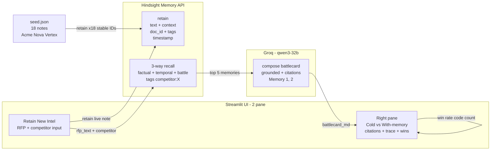

# Architecture — Mermaid (Figma export source)

Export: paste into Mermaid.live or Figma Mermaid plugin, 1600x900 PNG + SVG.

```mermaid
flowchart LR
    subgraph UI[Streamlit UI - 2 pane]
        IN[Retain New Intel<br/>RFP + competitor input]
        OUT[Right pane<br/>Cold vs With-memory<br/>citations + trace + wins]
    end
    subgraph MEM[Hindsight Memory API]
        RETAIN[retain<br/>text + context<br/>doc_id + tags<br/>timestamp]
        RECALL[3-way recall<br/>factual + temporal + battle<br/>tags competitor:X]
    end
    subgraph GEN[Groq - qwen3-32b]
        COMPOSE[compose battlecard<br/>grounded + citations<br/>Memory 1, 2]
    end
    SEED[seed.json<br/>18 notes<br/>Acme Nova Vertex]

    SEED -->|retain x18 stable IDs| RETAIN
    IN -->|retain live note| RETAIN
    IN -->|rfp_text + competitor| RECALL
    RECALL -->|top 5 memories| COMPOSE
    COMPOSE -->|battlecard_md| OUT
    OUT -->|win rate code count| OUT
```
